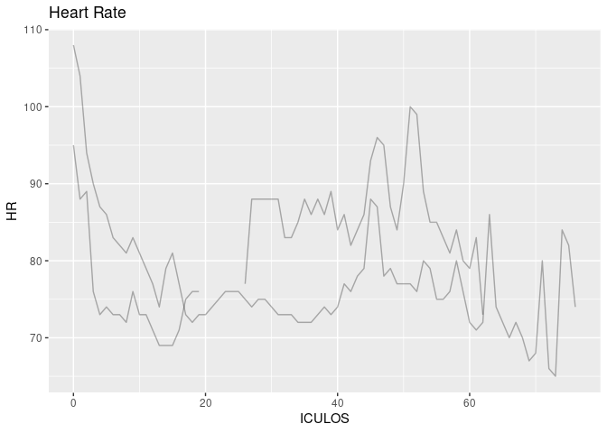
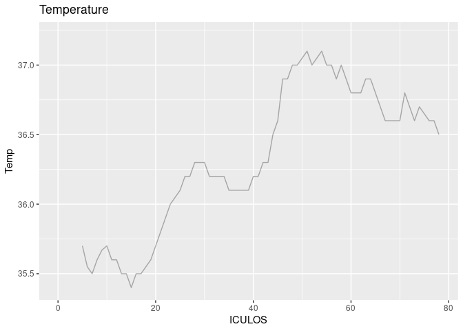
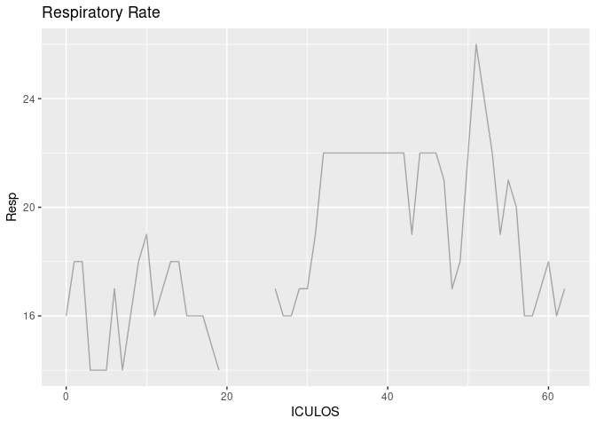

ICU status report
================

``` r
library(googledrive)
library(data.table) ## For the fread function
library(lubridate)
library(ggplot2)
library(dplyr)
library(readr)
drive_deauth()
file_link <- "https://drive.google.com/file/d/1hGMtOT-6TZIk-eFzrpgzxTJBGAj1SEwH/view?usp=share_link"
source("./sepsis_monitor_functions.R")
new_data <- updateData(file_link)

## Include only most recent data
most_recent_data <- new_data %>%
  group_by(PatientID) %>%
  filter(obsTime == max(obsTime))
```

Date and time of the report

    [1] "2023-04-10 01:00:01 UTC"

Patient who have sepsis right now

``` r
most_recent_data %>% filter(SepsisLabel == 1) %>% select(PatientID, HR, Temp, Resp)
```

    # A tibble: 2 × 4
    # Groups:   PatientID [2]
      PatientID    HR  Temp  Resp
      <chr>     <dbl> <dbl> <dbl>
    1 000346       73  NA      17
    2 004694       66  36.6    25

Plots for patients who have sepsis

``` r
# filter in patients who have sepsis
SepsisPt <- new_data %>% filter(SepsisLabel == 1) %>% select(PatientID) %>% unique() 

new_data %>% filter(PatientID %in% SepsisPt$PatientID) %>% ggplot(aes(x = ICULOS, y = HR)) +
    geom_line(aes(group = PatientID),
              alpha = 0.3) +
    ggtitle("Heart Rate")
```



``` r
new_data %>% filter(PatientID %in% SepsisPt$PatientID) %>% ggplot(aes(x = ICULOS, y = Temp)) +
    geom_line(aes(group = PatientID),
              alpha = 0.3) +
    ggtitle("Temperature")
```



``` r
new_data %>% filter(PatientID %in% SepsisPt$PatientID) %>% ggplot(aes(x = ICULOS, y = Resp)) +
    geom_line(aes(group = PatientID),
              alpha = 0.3) +
    ggtitle("Respiratory Rate")
```



A table showing change in measurements

``` r
Table <- new_data %>% 
    group_by(PatientID) %>% 
    filter(ICULOS %in% sort(ICULOS)[c(length(ICULOS), (length(ICULOS)-1))]) %>% 
    select(PatientID, HR, Temp, Resp) %>% 
    summarise(diff_hr = HR[2]-HR[1],
              diff_temp = Temp[2]-Temp[1],
              diff_resp = Resp[2]-Resp[1])
     
 print(Table, n=50)
```

    # A tibble: 50 × 4
       PatientID diff_hr diff_temp diff_resp
       <chr>       <dbl>     <dbl>     <dbl>
     1 000073         -4    NA             2
     2 000135         10     0.100         0
     3 000287         NA    NA            NA
     4 000346        -10    NA             1
     5 000617         NA    NA            NA
     6 001145          1    -0.200        -2
     7 001467        -13    NA             3
     8 001500         -5    NA             0
     9 001563         NA    NA            NA
    10 001748          1    NA            -9
    11 001851         -9    NA             1
    12 001904         NA    NA            NA
    13 002175        -21    NA            -1
    14 002240        -23    NA             0
    15 002638          1    NA             7
    16 003133          7    NA            -1
    17 003195         -8    NA           -17
    18 003242          0    NA             2
    19 003471          1    NA            NA
    20 003492          3    NA             5
    21 003524          7    NA            12
    22 003550          2    NA             9
    23 003642          3    NA             0
    24 003683         -3    NA            -5
    25 003823          1    NA             1
    26 003872        -12    NA             3
    27 003876         -2    NA            -5
    28 003883         -3    NA             0
    29 004089         NA    NA            NA
    30 004246         NA    NA            NA
    31 004331        -15    NA            -2
    32 004694         -8     0             0
    33 004753          3     0.100         0
    34 004853        -24    NA             0
    35 005001         11    NA            -2
    36 005894         16    NA             2
    37 006520          1    NA            -1
    38 006901          4    NA             5
    39 007045          4    NA             0
    40 007324         -3    NA            -3
    41 007612        -13    NA            -7
    42 007959         NA    NA            NA
    43 008791          1    NA            -3
    44 008820         -7    NA            -2
    45 008937         26    NA            -5
    46 009562         NA    NA            NA
    47 009606          9    NA            21
    48 009732          1    NA            -1
    49 009748          3    NA            -2
    50 009818          2    NA            -6
