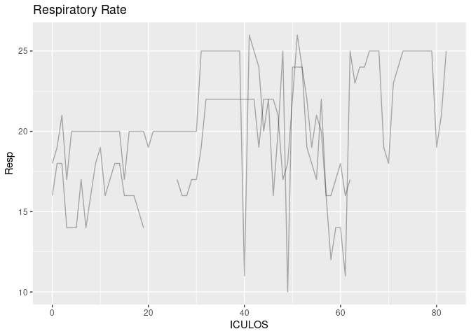

ICU status report
================

``` r
library(googledrive)
library(data.table) ## For the fread function
library(lubridate)
library(ggplot2)
library(dplyr)
library(readr)
drive_deauth()
file_link <- "https://drive.google.com/file/d/1hGMtOT-6TZIk-eFzrpgzxTJBGAj1SEwH/view?usp=share_link"
source("./sepsis_monitor_functions.R")
new_data <- updateData(file_link)

## Include only most recent data
most_recent_data <- new_data %>%
  group_by(PatientID) %>%
  filter(obsTime == max(obsTime))
```

Date and time of the report

    [1] "2023-04-09 00:05:07 UTC"

Patient who have sepsis right now

``` r
most_recent_data %>% filter(SepsisLabel == 1) %>% select(PatientID, HR, Temp, Resp)
```

    # A tibble: 0 × 4
    # Groups:   PatientID [0]
    # ℹ 4 variables: PatientID <chr>, HR <dbl>, Temp <dbl>, Resp <dbl>

Plots for patients who have sepsis

``` r
# filter in patients who have sepsis
SepsisPt <- new_data %>% filter(SepsisLabel == 1) %>% select(PatientID) %>% unique() 

new_data %>% filter(PatientID %in% SepsisPt$PatientID) %>% ggplot(aes(x = ICULOS, y = HR)) +
    geom_line(aes(group = PatientID),
              alpha = 0.3) +
    ggtitle("Heart Rate")
```


``` r
new_data %>% filter(PatientID %in% SepsisPt$PatientID) %>% ggplot(aes(x = ICULOS, y = Temp)) +
    geom_line(aes(group = PatientID),
              alpha = 0.3) +
    ggtitle("Temperature")
```


``` r
new_data %>% filter(PatientID %in% SepsisPt$PatientID) %>% ggplot(aes(x = ICULOS, y = Resp)) +
    geom_line(aes(group = PatientID),
              alpha = 0.3) +
    ggtitle("Respiratory Rate")
```



A table showing change in measurements

``` r
new_data %>% 
    group_by(PatientID) %>% 
    filter(ICULOS %in% sort(ICULOS)[c(length(ICULOS), (length(ICULOS)-1))]) %>% 
    select(PatientID, HR, Temp, Resp) %>% 
    summarise(diff_hr = HR[2]-HR[1],
              diff_temp = Temp[2]-Temp[1],
              diff_resp = Resp[2]-Resp[1])
```

    # A tibble: 50 × 4
       PatientID diff_hr diff_temp diff_resp
       <chr>       <dbl>     <dbl>     <dbl>
     1 000073         -4    NA             2
     2 000135         10     0.100         0
     3 000287         NA    NA            NA
     4 000346        -10    NA            -2
     5 000617         NA    NA            NA
     6 001145          1    -0.200        -2
     7 001467        -13    NA             3
     8 001500         -5    NA             0
     9 001563         NA    NA            NA
    10 001748          1    NA            -9
    # ℹ 40 more rows
